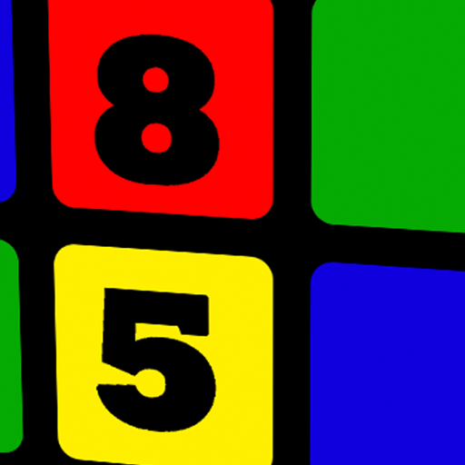

Rubik's Clock
==============================================================================

Rubiks'c clock presents a webpage of a Rubik's cube that automatically updates every minutes
showing the current time of day.



The implementation is based on the javascript/HTML code of Cuber found at https://github.com/stewdio/Cuber-DEMO. Cuber is a Rubik’s Cube simulator.  Rubik's Clock adds the concept of a photo cube to
Cuber.  The 6 PNG images are carefully crafted with a set of numbers on all sides.  It implements a solver that moves the pieces every minute so the numbers of the current hour and minute show on the front of the cube.


## Running Rubik's Clock

### From the desktop
There are two versions.  A 12-hour clock and a 24-hour clock.  The 12-hour clock rolls over at noon so the next hour is 1:00 (pm).  The 24-hour clock keeps counting up after noon so the next hour is 13:00.

From your Chrome browser (or Safari, or Edge, or a multitude of others) enter your choice:

- `index.html#clock12` for a 12-hour "am/pm" Rubick's clock
- `index.html#clock24` for a 24-hour "European" or "Military Time" clock


## Run as a Server
If you want to share the clock with your friends at home, it is very easy to
make this webpage available to any computer or smart phone in the house.

Install python3 if you don't already have it.  Then run this command:
`python3 -m http.server 80`

If you prefer the older python2 you could also do this:
`python2 -m SimpleHTTPServer 80`

The URL your friends will need is based on your computer name where you ran the previous command.  Often you need to append `.local` to the end of you computer's name to access it.  For instance, if your computer is named `mycomputer` then this is the URL you want to tell your friends to go to:

- `http://mycomputer.local/#clock12`
- `http://mycomputer.local/#clock24`

I put this on a dedicated Raspberry Pi that is continuously running at my house.  I named my Raspberry Pi `rubiks-clock` and I am an American partial to am/pm.  So this is what I tell my guests to go to from their smart phone:

- `http://rubiks-clock.local/#clock12`


Note: when typing in the URL on your browser, be careful which field put it.  don't type it into the Google search bar.  Google will never find it if it is just local inside your house.  Instead make sure to type it into the field for entering webpage URL addresses.  If one box does not work, ty the other.

Also, if you make changes locally, then you may need to clear cache to see the changes on a remote computer.

# Raspberry Pi 4 inch display

I used these instructions to install the 4 inch display from the commandline from ssh login on the Raspberry Pi:


  cd ~/Downloads
  sudo rm -rf LCD-show
  git clone https://github.com/goodtft/LCD-show.git
  chmod -R 755 LCD-show
  cd LCD-show/
  sudo ./MPI4008-show

Then from the commandline I run this (and hit F11 to exit full screen mode):

`chromium-browser --start-fullscreen 'file:///home/pi/rubiks-clock/index.html#clock12'`


# Origional Documentation

# History
**Note: This repository is merely an archive of my original Rubik’s Cube 
demo, interred here for historical purposes—to document my initial conceptual 
approach and to exemplify my insane flair for code comments, complete with 
ASCII art illustrations. Cuber went on to power the 
[Rubik’s Cube Google Doodle](https://www.google.com/doodles/rubiks-cube),
the [Chrome Cube Lab](https://chrome.com/cubelab) experiments, and my own 
[Rubik’s Cube Explorer](http://iamthecu.be). It was also used to create
the branding for the Liberty Science Center 
[Beyond Rubik’s Cube exhibition](http://brc.lsc.org). 
For more information see [Stewdio](http://stewd.io/w/rubikscube).**


============================================================================
# Raspberry Pi

These are instructions that show how to set this up on a Raspberry Pi with a 4 inch display

## Supplies

You will need:

- Raspberriy Pi 4B
- 32GB (or larger) micro SDcard
- Miuzei 4-inch display https://www.amazon.com/dp/B07XBVF1C9?psc=1
  - https://geekdiywiki.com/4inchscreen
  - 

Install Raspberry Imager onto your PC (https://www.raspberrypi.com/software/)
)

Run the Raspberry Pi Imager on your PC

- Insert 32GB SDCard into an sdcard reader and plug into a USB port
- Operating System: Raspberry Pi OS (32 bit)
- Storage:
  - Probably just one option
  - But it is very important to make sure you a pick the SDCard that you recently inserted
    - Verify the size matches the size of your SDCard.  E.g. 32 GB

It will take 5-10 minutes or more to write the Raspberry Pi image onto the SDCard.  Be patient.
- Writing... xx%
- Verifying... xx%

Insert SDCard into your Rasbberry Pi 4B

The Miuzei display comes with 4 heat sinks. Stick on all of the heat sinks onto the Raspberry Pi board in the correct places.

Connect keyboard, mouse, and HDMI monitor to Raspberry Pi
Power on

ssh pi@rubiks-clock.local


## Installing DIsplay Driver
The Miuzei 4-inch display requires special driver to run on a Raspberry Pi.
Download the package from the website and install based on the instructions.


============================================================================


# Cuber Notes

Running Cuber
------------------------------------------------------------------------------

__From the desktop__  
Simply drop the `index.html` file onto a Chrome browser window.

__From an ad-hoc server__  
From the command line type the following to create a server, where `8000` 
(the default) is an optional port number argument:
`python -m SimpleHTTPServer 8000`

__From Apache__  
The file `/.htaccess` is configured to require a valid login which you will 
need to configure on your own server. Alternatively this file can be removed
from the package entirely.


Methodology
------------------------------------------------------------------------------

__Separation of state and visuals__  
I wanted to keep the Cube’s internal state entirely separate and independent 
of the visual rendering as a way to hopefully allow for future ports to serve
new and unforeseen purposes. Sometimes it makes for what seems like redundancy
but I think in the long term it’ll be worth it. 

__Modularity__  
I’ve tried to break the problem down into what amounts to Classes. I’m a 
big fan of Prototypal Inheritance but I’m hoping this approach—including 
separating these Classes into separate files—makes things clear and easy.
Also it’s pretty awesome when you’re inspecting things via the console and 
the console can actually tell you that this particular Array holds Cubelets, 
for example. The bulk of the fun located in `/scripts/models/`. The app is 
controlled by `/scripts/models/erno.js`

__Global scope and the Console__  
Lambda functions are great. And namespacing components into wrapper objects
can be seriously useful. But I’ve purposely (and carefully) placed a lot
of important bits right into the main scope so that tinkerers may pop open 
Chrome’s JavaScript Console and start poking around. This also makes it easy 
to write bookmarklets or other hacks.

__Documentation__  
Through code comments I’ve tried very hard to be as clear as possible about
what I’m doing and why I’m doing it. This is only partially altruism. 
It’s perhaps primarily so I can have some chance of understanding my own code
at some future date. Ever write an app and come back to it six months later?
Yea. It’s a problem. That’s why I comment so heavily.


JavaScript console fun
------------------------------------------------------------------------------

__Inspection__  
I’ve endeavored to make the Cube highly inspectable from both third-party 
scripts and by humans using the browser’s console. To get a quick sense of 
what’s possible try out each of the following commands. (It’s fun!)
```
cube.inspect()  
cube.inspect( true )  
cube.front  
cube.front.northWest.inspect()  
cube.front.northWest.up.color.name  
```
To understand the basic vocabulary and mapping of the Cube and Cubelets see 
the comments at the head of `cube.js`, `slices.js`, and `cubelets.js` within
the `/scripts` folder. (Also, if your browser does not support CSS styling 
within the console you’re going to have a bad time.)

__Manipulation__  
It’s also easy to alter properties of the Cube like so:
```
cube.standing.setOpacity( 0.1 )  
cube.corners.setRadius( 90 )  
cube.corners.getRadius( 90 )  
```
These functions are chainable. And really, who doesn’t love chaining?
```
cube.hidePlastics().hideStickers().showWireframes().showIds()
```
If you’re hungry for more check out `groups.js` to see all the goodies.

__Search__  
Lurking around `groups.js` you’ll also spot some filtering functions: 

```
cube.hasColors( RED, BLUE ).showIds()  
cube.hasId( 0 )//  A Cubelet’s ID never changes.  
cube.hasAddress( 0 )//  But its address changes when it moves.  
cube.hasProperty( 'address', 0 )//  Equivalent to previous line.  
```
And guess what—these are also chainable. (I know, right?!)
```
cube.hasColors( RED, BLUE ).hasType( 'corner' ).setRadius( 90 )
```

__Solving__  
The infrastructure for writing solvers is more or less there. Calling 
`cube.solve()` will set `cube.isSolving = true` and then with each run through
`cube.loop()` the selected solver will be asked to assess the Cube. I’ve 
provided the bare beginnings of a simple layer-by-layer solver. Sadly, I only 
got as far as solving the Top Cross but hopefully the solver’s code comments 
and verbose console output can serve as a primer for you to write your own!
Lagniappe: While writing the solver it seemed really helpful to fully define
the idea of _orientation_ / _direction_ so I wrote a Class and some STATICs 
that make comparing directions a little easier. (See `directions.js` for 
details.)
```
FRONT.getOpposite() === BACK  
FRONT.neighbors  
FRONT.getClockwise()  
FRONT.getClockwise( 2 )  
```
The spacial mapping used here is defined at the head of `cubelets.js`. 
Whatever face you’re looking at has an inherrent ‘up’ and from that reference
point you can ask what face we’d be looking at if we rotated clockwise by a
90 degree twist, for example. 
```
FRONT.getUp() === UP  
FRONT.getClockwise() === RIGHT  
UP.getUp() === BACK  
UP.getRotation( -1, LEFT )  
```
It gets weird pretty quickly but once you’re in the correct headspace these 
functions become incredibly useful. Why do all this rather than hardcore 
matrix math? Because 42.


Code typography
------------------------------------------------------------------------------

__Semicolons__  
First, I only use semicolons when absolutely necessary. By definition any
valid JavaScript interpreter _must_ perform automatic semicolon insertion. 
This means you just don’t need them. Let me repeat: YOU JUST DON’T NEED THEM.
Leaving them out makes your code typographically cleaner; reduces visual 
clutter and noise in the signal. It’s good for your soul.

__Whitespace__  
I use tabs, not spaces for codeblock indentation—functions, object blocks, and
so on. Tab is the only true unit of indentation. My tabs are the width of four
spaces. Two is too small. Eight is just too damn wide. Within lines of code 
I’ll often add bits of whitespace to line up consecutive equal signs or other
recurring symbols if it’s subtle and not too wonky:
```  
right = 2  
left  = 3  
```  

I’ll often add a space between an open-parenthesis and a token; same for 
between a token and close-parenthesis. Line breaks after an open bracket are
also desirable. 

__Comments__  
Two line breaks before line comments. One line break after them. Two spaces 
following a comment’s slashes. (One for hanging quotation marks in order to
optically align the text itself.) For critical to-do’s I add two juxtaposed
ampersats to both visually separate them and make them easy to search for. 
Just a quirk of mine. Occasionally if the situation calls for it I’ll use 
special “rhombus” commnents for big visual breaks. They have three horizontal 
spaces between slashes and text and vertical padding inside like so:  
```  
    /////////////////  
   //             //  
  //   Rhombus   //  
 //             //  
/////////////////  
```  
I pad these rhombus comments with four line breaks above and two below.


Colophon
------------------------------------------------------------------------------

Stewart Smith  
Occasionally stabbed at in 2013  


